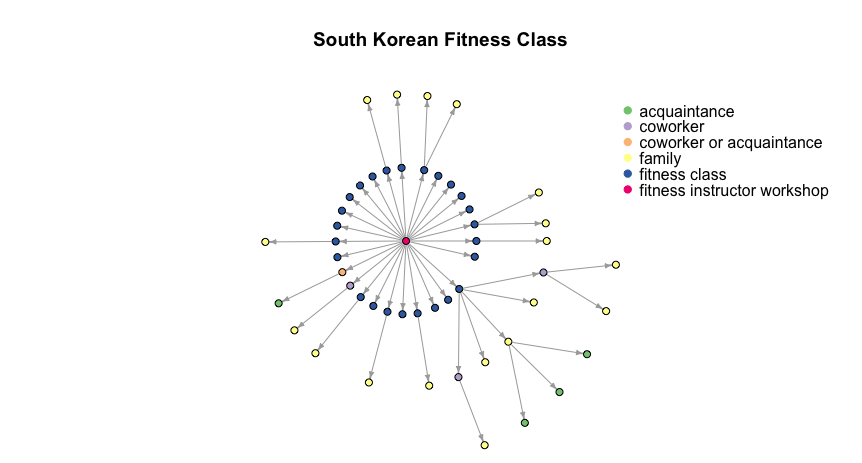

```{r setup, include=FALSE}

rm(list=ls())

library(knitr)
library(tidyverse)
library(magrittr)
library(ggplot2); theme_set(theme_bw())
library(shinyBS)
library(shinyjs)
library(plotly)
library(igraph)
library(RColorBrewer)
library(rmarkdown)
library(flexdashboard)
library(shiny)
library(DT)

source("scripts/functions.R")

knitr::opts_chunk$set(echo = FALSE, message = FALSE)

# clean data slightly (should do this in tree creation)
treeDat <- readRDS("data/data_tibble_trees.RDS") 

```

About 
=========================================

#### What are transmission trees? 

Infectious disease outbreaks are commonly reported and displayed in the form of _transmission trees_, where individuals are represented by nodes and disease transmission events are represented by branches. Transmission trees are usually obtained from outbreak investigations or genomic reconstructions. 

Because transmission trees are rich sources of information, and collecting them is resource-intensive for public health professionals, we created a standardized tree database. We hope this database can facilitate analyses of: 

- Variation in outbreak size spread across diseases, time, or space
- Variation in spread across contexts (work, household) and demographics (age, sex)
- The presence of superspreaders, and their importance
- Intervention efficacy
- The number of missing or unreported cases

This dashboard allows you to download the database including igraph objects of transmission trees and available attributes. In addition, users can filter the database to find relevant resources for diseases of interest at [Explore Database Tab](#ExploreDatabase) and plot transmission trees at [Explore Trees Tab](#ExploreTrees). More information on data collection is available in the [More Information Tab](#DownloadDatabase). 

```{r fig.width=8}
# static plots don't need to be reactive
# example covid tree
# treeDat %>% filter(id=="kor.2020.covid.5.01") -> exampleTree
# exampleTree=exampleTree$tree[[1]]
# 
# # plotting params, plot igraph in tree layout
# pal <- brewer.pal(6,"Accent")
# Group <- factor(V(exampleTree)$cont)
# vertex.col <- pal[Group]
# 
# par(mar=c(0,1,4,0), xpd=TRUE)
# plot(exampleTree, layout=layout_as_tree(exampleTree, circular = T),
#      vertex.color=vertex.col, main="South Korean Fitness Class",
#      vertex.label="", vertex.size=4, edge.arrow.size=0.45)
# 
# legend(x=1,y=1, bty = "n",pch = 19,
#        legend=levels(Group),
#        col=pal, border=NA)

``` 



Explore Database {#ExploreDatabase}
=========================================

Column
-------------------------------------

### Structure of Database

The database contains basic descriptive information for each tree including the disease, year of the outbreak, size of the tree, where the outbreak occurred, and available attributes. The source for each tree is contained in the `Source` column. 

```{r table_trees}
 
dt <- treeDat %>% 
  mutate(Source=paste0("<a href='",Source.Link,"' target='_blank'>",Source,"</a>")) %>%
  dplyr::select(id, Disease, Year, Size, Attributes, Source) %>% 
  arrange(Attributes)

DT::dataTableOutput("responses")
output$responses <- DT::renderDataTable({
  DT::datatable(dt,
          caption="Filter the database to find relevant resources for diseases of interest. Enter the id variable to plot transmission trees in Explore Trees tab.",
          rownames=F,
          filter="top",
          options = list(  pageLength = 10),
          escape = FALSE, selection = 'single')
})

```

Explore Trees {#ExploreTrees}
=========================================

Inputs {.sidebar data-width=200}
-------------------------------------
Use the Explore Database tab to find trees you wish to plot and enter the tree `id` here. Select among common attributes to plot. 

```{r}
#DT::dataTableOutput("responses")

# tree to plot
selectInput(inputId = "id1",
                label = "Select Transmission Tree:",
                choices = sort(unique(treeDat$id)),
            selected = "kor.2020.covid.5.01")

selectedDat <- reactive({
    treeDat[treeDat$id==input$id1, ]
})

# attribute to color nodes
selectInput(inputId = "graphColor",
                label = "Select Attribute to Plot:",
                choices=c("Context", "Sex","Age","Location",
                          "Quarantine status","Occupation","Relation to infector"),  
            #choices = c("cont", "sex", "age", "loc", "quar", "occp", "rel","seq",
                #            "trans","dur"),
            selected = "cont")

# size of nodes (can make bigger for smaller trees, viceversa)
sliderInput(inputId = "nodeSize", label = "Set Node Size:", min=1, max=7, value = 3)

# allow download of this specific tree
output$treeButton <- downloadHandler(
    filename = function() {"selected_tree.rds"},
    content = function(file){
        write_rds(selectedDat(), file)
    }
)
shiny::downloadLink(outputId = "treeButton", label = "Download selected transmission tree here.")

```

Column {data-width=500}
-------------------------------------

### Transmission Tree

```{r}

renderPlot({
  # table for graph color input
  attTable <- data.frame(code=c("cont", "sex", "age", "loc", "quar", "occp", "rel"),
                         selected=c("Context", "Sex","Age","Location",
                          "Quarantine status","Occupation","Relation to infector"))
  # selected options
  g <- selectedDat()$tree[[1]]
  selAtt <- input$graphColor
  thisAt <- as.character(attTable$code[attTable$selected==selAtt])
  nodeSizes <- input$nodeSize
  
  # use selected attribute to determine node colors
  Group <- (get.vertex.attribute(g, as.character(thisAt)))
  Group[is.na(Group)] <- "Attribute N/A"
  Group <- factor(Group)
  
  if(length(levels(Group))<=8){
    pal <- brewer.pal(length(levels(Group)), "Accent")
  }
  if(length(levels(Group))>8){
    pal <- colorspace::rainbow_hcl(n=length(levels(Group)))
  }
  
  nodeCols <- pal[Group]
  
  # fix NA color
  #nodeCols[which(Group=="Attribute N/A")] <- "darkgrey"
  
  # set plot title
  subloc <- ifelse(!is.na(selectedDat()$Sublocation), selectedDat()$Sublocation, "")
  pt=paste0(selectedDat()$Disease, " (", subloc, ifelse(subloc == "", "", ", "), selectedDat()$Country,
          " ", selectedDat()$Year, ")")

  # plot
  par(mar=c(3,1,5,0), xpd=FALSE)
  if(length(levels(Group))>0){
    if(vcount(g)<4){
      igraph::plot.igraph(g, 
                      main=pt,  # set inside renderplot
                      vertex.color=nodeCols, #from user input
                      vertex.size=nodeSizes, # from user input
                      edge.arrow.size=0.35, vertex.label="")
      legend(x=.25, y=.95, bty = "n",
      legend=levels(Group),
      fill=pal, border=NA, cex = .75, ncol=1)
    }else{
          igraph::plot.igraph(g, 
                      main=pt,  # set inside renderplot
                      vertex.color=nodeCols, #from user input
                      vertex.size=nodeSizes, # from user input
                      edge.arrow.size=0.35, vertex.label="", 
                      layout=layout_as_tree(g, circular = T))
    legend(x=.25, y=.95, bty = "n",
    legend=levels(Group),
    fill=pal, border=NA, cex = .75, ncol=1)
    }
  }

  if(length(levels(Group))==0){
    igraph::plot.igraph(g, 
                      #main=pt,  # set inside renderplot
                      vertex.color=brewer.pal(3,"Accent")[2],
                      vertex.size=nodeSizes, # from user input
                      edge.arrow.size=0.35, vertex.label="")
    mtext(side=3, line=-1, paste0("Attribute (", thisAt, ") \n not available for this tree"))
  }
  
})


```

Column {data-width=250}
-------------------------------------
### Tree Metadata

```{r}
renderTable({
  selectedDat() %>%
    # would like this to be a link but not working rn (needs to render as a json 
    # table or figure out how to do in Rmd)
    #mutate(Source=paste0("<a href='",Source.Link,"' target='_blank'>",Source,"</a>")) %>%
    dplyr::select(Size, `Num SS`, Attributes, Source) 
})
```

### Distribution of Individual R in this tree

```{r}
renderPlot({
g=selectedDat()$tree[[1]]
degs=data.frame(degree=degree(g, mode="out")) %>% 
  group_by(degree) %>%
  tally(name="freq") 

# pad degree distrib with 0s
degs%<>%full_join(data.frame(degree=1:max(degree(g, mode="out"))))%>%arrange(degree)

degs %>%
  ggplot(aes(x=factor(degree), y=freq)) + 
   geom_bar(stat="identity") + labs(title="", x="",y="Frequency")
})

```


Download Database and More Information {#DownloadDatabase}
=========================================

Inputs {.sidebar data-width=200}
-------------------------------------
#### Code

Users can find example code showing how the database was compiled and how to use it on [Github](https://github.com/DrakeLab/taube-transmission-trees).

```{r downloadDB}

output$dwnButton <- downloadHandler(
    filename = function() {"taube_2020_transmission_trees.rds"},
    content = function(file){
        write_rds(treeDat, file)
    }
)
shiny::downloadLink(outputId = "dwnButton", label = "Download database here.")

```

#### Contributions

We invite contributions to this database. To contribute:    
John M. Drake  
`jdrake@uga.edu`. 

#### Questions

Questions, Suggestions:  
Juliana C. Taube
`taubejc@gmail.com`
					  
#### Citation

Please cite this database as:  
Taube JC, Miller PB, and Drake JM 2020.  
OutbreakTrees: Transmission Trees of Human Pathogens. 

#### Funding

This work was conducted as a part of the Population Biology of Infectious Diseases REU Site, a program funded by the National Science Foundation (Grant #DBI-1156707) and the University of Georgia.

#### Terms

<p><a rel="license" href="http://creativecommons.org/licenses/by/4.0/">
</a>  
<a href="http://opendefinition.org/"></a>
<a href="http://opendefinition.org/"></a>
<p>Content and data on this site are licensed under a 
<a rel="license" href="http://creativecommons.org/licenses/by/4.0/">Creative Commons Attribution 4.0 International License</a>.</p>
<p><a href="https://eits.uga.edu/access_and_security/infosec/pols_regs/policies/privacy/">Privacy Policy</a></p>


Column
-------------------------------------

### Methods

#### Data collection

Transmission trees were initially collected by searching Google Scholar, Scopus, PubMed, and Google Images for published literature using, among other terms: "transmission tree", "transmission chain", "transmission network", "outbreak investigation", "contact tracing", and "case report". With the emergence of COVID-19, we expanded our search to consider news articles and not-yet peer-reviewed sources (e.g. from medRxiv) with COVID-19 transmission trees. Many of these clusters were gathered from an online database, updated through July 6, 2020 [1]. If trees could not be readily collected from an article alone, we emailed authors of the paper to see if data could be shared with us or diagrams could be clarified to meet our inclusion criteria (see below). Each tree had a unique set of node attributes based on the available data. Attributes included, but were not limited to, age, sex, context of transmission, date of symptom onset, occupation, quarantine status, survival status, and location.

[1] Leclerc, Q.J., Fuller, N.M., Knight, L.E., Funk, S., Knight, G.M. and CMMID COVID-19 Working Group, 2020. What settings have been linked to SARS-CoV-2 transmission clusters?. Wellcome Open Research, 5(83), p.83.

#### Inclusion and Exclusion Criteria

Accepted transmission trees had two or more individuals, had been constructed through mainly epidemiologic or probabilistic methods, identified specific infectors and infectees, had only a single infector per infectee, and described a disease that was directly transmitted. Trees constructed using only genomic data or with more than one occurrence of multiple possible infectors for a single individual were excluded. Additionally, trees describing sexually-transmitted, food, vector, or waterborne diseases, as well as trees with non-human individuals were excluded. 

The only time trees that did not identify a single infector were included was when we could attribute infection to a single individual without changing the tree topology and by omitting more specific node attributes. If cases were all linked to a location, but not an individual infector, only the local chains of transmission stemming from that exposure were included as separate trees. Trees presented as clearly incomplete and still under ongoing investigation were excluded at this time. Articles in languages other than English were translated using Google Translate software.

#### Data Entry

Trees were inputted manually as data.tree objects using information given in the relevant figure and text. We coded each tree as accurately as we could and reached out to authors for clarification if necessary. However, as with any outbreak investigation, cases may be missed due to lack of detection, misdiagnosis, and incomplete contact tracing efforts, among other reasons. Any assumptions made in entering the tree are listed under the `Notes` section of the database entry.

### Data summary 

Currently, this database contains 383 transmission trees for 16 directly-transmitted infectious diseases, most of which are caused by viruses. 256 trees describe outbreaks of COVID-19. Tree outbreak size ranges from 2 to 286. The sample of trees in our database should not be considered representative for each disease as we expect it to be skewed towards outbreaks with intermediate sizes, taking place in countries with greater capacity for epidemiological case follow-up.

### Attribute Meta-Data

| Attribute | Meaning |
|---|---|
| cont  | context of suspected transmission event (family, household, meal, hospital, etc.)  |
| sex  | sex of individual   |
| age  | age of individual |
| loc  | location  |
| quar  | quarantine status  |
| occp  | occupation of individual, if relevant |
| rel  |  relationship to infector |
| seq  |  strain sequence, if relevant |
| trans  | information regarding certainty/knowledge of transmission pattern (probabilistic vs epidemiologic, or source of transmission link if tree constructed from multiple sources)  |
| dur  | duration of exposure period, if known  |

